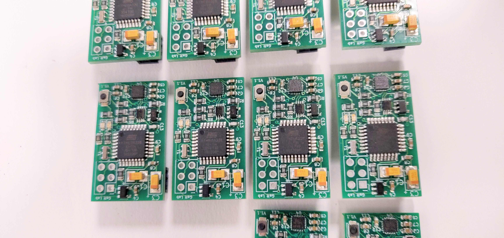
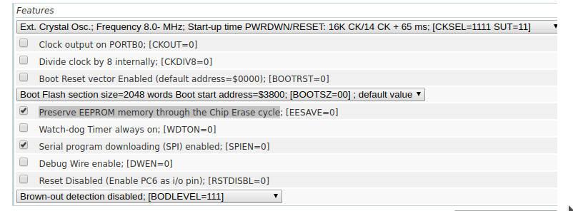

# Mini Data Capture



[](https://ci.appveyor.com/project/pollend/mini-data-capture)


## Programming

```avrdude -c <programmer> -p atmega328 -b 57600  -U flash:w:main.hex -U lfuse:w:0xff:m -U hfuse:w:0xd1:m -U efuse:w:0xff:m```



[Fuse Calculator](http://eleccelerator.com/fusecalc/fusecalc.php?chip=atmega328p)


## Maintainers

The current maintainers of this repository are:

* Michael Pollind <polli104@mail.chapman.edu>


# License

```
/**
* Copyright 2018 GaitRehabilitation
*
* Licensed under the Apache License, Version 2.0 (the "License");
* you may not use this file except in compliance with the License.
* You may obtain a copy of the License at
*
*     http://www.apache.org/licenses/LICENSE-2.0
*
* Unless required by applicable law or agreed to in writing, software
* distributed under the License is distributed on an "AS IS" BASIS,
* WITHOUT WARRANTIES OR CONDITIONS OF ANY KIND, either express or implied.
* See the License for the specific language governing permissions and
* limitations under the License.
*/

```
